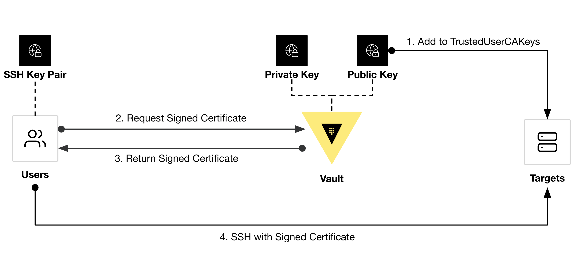

# Vault SSH OTP Demo

### Overview
The One-Time SSH Password (OTP) SSH secrets engine type allows a Vault server to issue a One-Time Password every time a client wants to SSH into a remote host using a helper command on the remote host to perform verification.

- https://developer.hashicorp.com/vault/tutorials/secrets-management/ssh-otp
- https://developer.hashicorp.com/vault/docs/secrets/ssh/one-time-ssh-passwords


### Diagram
<p align="center">
  
</p>


### Infrastructure Setup (Vault)
```shell
git clone ...
cd ./vault-ssh-signing-demo/tf/vault
terraform init
terraform apply
export VAULT_ADDR=$(terraform output -raw vault_addr)
export VAULT_TOKEN=$(terraform output -raw vault_token)
```

### Vault Setup
```shell
vault status

vault secrets list

vault secrets enable ssh

vault write ssh/config/ca generate_signing_key=true

# standard shell
vault write ssh/roles/demo - <<EOF
{
  "algorithm_signer": "rsa-sha2-256",
  "allow_user_certificates": true,
  "allowed_users": "ubuntu",
  "allowed_extensions": "permit-pty,permit-port-forwarding",
  "default_extensions": {
    "permit-pty": ""
  },
  "key_type": "ca",
  "default_user": "ubuntu",
  "ttl": "30m"
}
EOF

# force command
vault write ssh/roles/demo2 - <<EOF
{
  "algorithm_signer": "rsa-sha2-256",
  "allow_user_certificates": true,
  "allowed_users": "ubuntu",
  "allowed_critical_options": "force-command",
  "default_critical_options": {
    "force-command": "cat /var/log/example.log"
  },
  "key_type": "ca",
  "default_user": "ubuntu",
  "ttl": "30m"
}
EOF
```

### Infrastructure Setup (VM)
```shell
cd ..
terraform init
terraform apply -var="vault_addr=$VAULT_ADDR"
export REMOTE=$(terraform output -raw demo_ip)
```

### Vault Usage
```shell 
ssh-keygen -t rsa -C "user@example.com" -f $HOME/.ssh/id_rsa_demo

# standard shell
vault write -field=signed_key ssh/sign/demo public_key=@$HOME/.ssh/id_rsa_demo.pub > $HOME/.ssh/id_rsa_demo-cert1.pub

ssh -i $HOME/.ssh/id_rsa_demo-cert1.pub -i $HOME/.ssh/id_rsa_demo ubuntu@$REMOTE

# force command
vault write -field=signed_key ssh/sign/demo2 public_key=@$HOME/.ssh/id_rsa_demo.pub > $HOME/.ssh/id_rsa_demo-cert2.pub

ssh-keygen -Lf $HOME/.ssh/id_rsa_demo-cert2.pub

ssh -i $HOME/.ssh/id_rsa_demo-cert2.pub -i $HOME/.ssh/id_rsa_demo ubuntu@$REMOTE
```

### Cleanup
```shell
terraform destroy -var="vault_addr=$VAULT_ADDR"
terraform -chdir=vault destroy
rm $HOME/.ssh/*demo*
```
